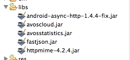

# Android 统计 SDK 开发指南

## 建立 LeanCloud app，下载 SDK

您可以在cn.avoscloud.com上创建新的应用，然后下载LeanCloud Android SDK以及相应的demo。


## 创建 Android 工程，使用 LeanCloud 基本的统计功能

您可以从 [SDK下载页面](https://cn.avoscloud.com/docs/sdk_down.html) 下载android的SDK。


## 导入 SDK

除了必须的avoscloud.jar外，您还需要额外的导入avosstatistics.jar。
请将下载的jar包放到libs目录下，以便您的IDE(Eclipse或者Intellij IDEA等)可以正常识别导入的jar包。如以下图片所示




## 配置 AndroidManifest.xml 文件

请务必确保您的应用拥有如下权限

* 添加权限`android.permission.INTERNET`, 向AVOSCloud的统计服务器发送用户分析数据。
* 添加权限`android.permission.READ_PHONE_STATE`和`android.permission.ACCESS_WIFI_STATE`, 这两个权限是为了获取用户手机的IMEI以及WiFi的Mac地址，用来唯一的标识用户。
* `android.permission.ACCESS_NETWORK_STATE` ,用以检测网络状态。
* `android.permission.READ_LOGS`, 用于获取客户端crash log。通过将crash log汇报到服务器上，您可以了解您的应用crash的原因以及次数。
* `android.permission.WRITE_EXTERNAL_STORAGE` , 用于保存离线报告的缓存数据。

以下为示例部分
```

    <manifest ……>
        <application ……>
            ……
            <activity ……/>
        </application>
        <uses-permission android:name="android.permission.WRITE_EXTERNAL_STORAGE" />
        <uses-permission android:name="android.permission.INTERNET"/>
        <uses-permission android:name="android.permission.ACCESS_NETWORK_STATE" />
        <uses-permission android:name="android.permission.READ_PHONE_STATE" />
        <uses-permission android:name="android.permission.ACCESS_WIFI_STATE" />
    </manifest>

```

如果您想指定您的发布渠道，请在AndroidManifest.xml中加入如下内容。

```
    <application  ...>
        ...
        <meta-data android:name="Channel ID" android:value="LeanCloud"/>
    </application>
```

您可以根据您的实际发布渠道，修改上述的Channel ID对应的值，比如将LeanCloud改为Your Channel，重新打包后发布。


## 添加使用代码

添加引用:


经过我们的一系列更新升级, 使用最新的SDK您不需要任何代码上的操作就可以使用统计的基本功能，统计功能为默认打开


```
import com.avos.avoscloud.*;


public class YourApp extends Application{

    public void onCreate() {
        super.onCreate();
        AVOSCloud.initialize(this, "{{appid}}", "{{appkey}}");
        //AVAnalytics.start(this);    已经不再需要这行代码了
        AVAnalytics.enableCrashReport(this, true);

    }
}
```

## 统计页面路径

在需要的Activity中调用统计SDK。 在每个Activity的onResume和onPause方法中调用相应的统计方法，传入的参数为当前context（比如当前的Activity）的引用。 这里请不要将全局的Application Context传入。如示例所示

```
    protected void onPause() {
        super.onPause();
        AVAnalytics.onPause(this);
    }

    protected void onResume() {
        super.onResume();
        AVAnalytics.onResume(this);
    }
```


请确保在所需要的所有的Activity中都调用AVAnalytics.onResume() 和AVAnalytics.onPause()方法，这两个调用将不会阻塞应用程序的主线程，也不会影响应用程序的性能。注意如果您的Activity之间有继承或者控制关系请不要同时在父和子Activity中重复添加onPause和onResume方法，否则会造成重复统计(例如使用TabHost、TabActivity、ActivityGroup时)。一个应用程序在多个activity之间连续切换时，将会被视为同一个session(会话或者一次使用过程)。

当用户两次使用之间间隔超过30秒时，将被认为是两个的独立的session，例如用户回到home，或进入其他程序，经过一段时间后再返回之前的应用。 我们也提供了新的接口来自定义这个时间间隔，您只要调用：

```
AVAnalytics.setSessionContinueMillis(long mills);
```

传入适当的参数，就可以控制session重新启动时间，注意参数是以毫秒为单位的。 例如，如果您认为在60秒之内返回应用可视为同一次启动，超过60秒返回当前应用可视为一次新的启动，那么请写成

```
AVAnalytics.setSessionContinueMillis(60 * 1000);
```

## 统计 Fragment 页面

Android 3.0引入了Fragment, 使用Fragment，您可以在一个activity中展示多个用户界面，也可根据您的需要，为不同的设备适配界面。从1.4.2开始，LeanCloud SDK增加了对于Fragment统计的支持。您可以使用以下代码统计Fragment页面

```
public class MyListFragment extends ListFragment {
    public void onAttach(Activity activity) {
        super.onAttach(activity);
    }

    public void onStart() {
        super.onStart();
    }

    public void onPause() {
        super.onPause();
        AVAnalytics.onFragmentEnd("my-list-fragment");
    }

    public void onResume() {
        super.onResume();
        AVAnalytics.onFragmentStart("my-list-fragment");
    }
}
```


## 测试

* 确认所需的权限都已经添加：INTERNET, READ_PHONE_STATE, READ_LOGS, WRITE_EXTERNAL_STORAGE
* 确认所有的Activity中都调用了onResume和onPause方法
* 确认测试手机(或者模拟器)已成功连入网络
* 启动应用程序，几分钟之内您应该已经可以看到相应的报表.


## 使用自定义事件

### 基本简单事件
除了基本统计分析功能外，AVOSClud SDK还支持您自定义的事件分析，例如您可以统计您的应用中有多少人点击了like按键，某个文章的点击次数或者视频被播放的次数等等。

在您希望发送事件报告的代码段，调用如下方法就可以向服务器发送事件记录

```
AVAnalytics.onEvent(Context context, String eventName);
```

统计eventName对应事件的发生次数，变化趋势，例如like点击，浏览数量等等。参数context为当前context的引用。eventName为当前统计的事件name，注意eventName中不要加空格或其他的转义字符

比如，在玩拍应用程序里一条微视频被转发定义为事件"Forward"。那么在点击转发的函数里调用

```
AVAnalytics.onEvent(this, "Forward")
```

就会向服务器汇报一个转发的事件。


### 多标签事件

```
AVAnalytics.onEvent(Context context, String eventName, String  tag);
```

除了能够统计eventName所对应事件的发生次数，变化趋势外，还能统计事件中具体标签所占的比例。tag为当前标签，同样这里的eventName字符串中也请不要使用空格。
比如，在玩拍程序中，我们定义了一个发布微视频的多标签事件"Publish"，对应的发布内容有"title"（发布标题）,"Video"（发视频）,"type"（视频类型）,来对应不同的发布类型，这样我们不仅可以记录Publish事件的点击数量还可以看到不同内容对应的比例。
多标签事件分析图表示例


事件累计
在应用程序中某些自定义事件可能会被频繁触发，例如用户点击某个按钮。开发者可以在程序中维护一个计数器，这样某个事件被多次触发但只需要生成一个消息，这个消息中包括该事件被触发的次数。为了支持这个功能，我们提供了重载的接口：

```
AVAnalytics.onEvent(Context context, String eventName, int count);
AVAnalytics.onEvent(Context context, String eventName, String label, int count)
```

参数count是对应事件 （和对应标签）被触发的次数。


## 设置数据发送策略
您可以进入应用的 [分析 -> 统计设置（左下角） -> 数据发送策略](/stat.html?appid={{appid}}&os=android#/statconfig/trans_strategoy) 在线更改SDK端的数据报告发送策略。在没有取到在线配置的发送策略的情况下，会使用默认的发送策略.

以下均为在线配置中的可选策略


### 启动时发送（推荐使用）
应用程序每次会在启动时会向服务器发送一次消息，在应用程序过程中产生的所有消息(包括自定义事件和本次使用时长)都会在下次启动时候发送。 如果应用程序启动时处在不联网状态，那么消息将会缓存在本地，下次再尝试发送。

发送策略默认为启动时发送。

### 批量发送
批量发送，默认当消息数量达到30条时发送一次。

### 按最小间隔发送
间隔一段时间发送，每隔一段时间一次性发送到服务器。

## 自定义参数设置
您可以控制台某个应用的`组件 -> 自定义参数设置`中配置你的自定义在线参数。这些参数会在我们每次更新统计配置时进行更新，您可以通过`AVAnalytics.getConfigParams(this.getContext(), "key")`来获得对应的值。

但是请您注意三点：

* key必须跟您在控制台配置的参数一致，大小写敏感。
* 由于统计参数更新时一个后台更新，您可能在直接调用`AVAnalytics.getConfigParams(this.getContext(), "key")`时遇到返回值为null的情况。您可以通过设置AVOnlineConfigureListener和强制调用updateOnlineConfig来保证自定义配置的获取。

```
            AVAnalytics.setOnlineConfigureListener(new AVOnlineConfigureListener() {
              @Override
              public void onDataReceived(JSONObject data) {

                   AVAnalytics.getConfigParams(getContext(), "key");
              }
             });
            AVAnalytics.updateOnlineConfig(getContext());
```
* 由于统计参数在客户端会有定时更新的策略，所以AVOnlineConfigureListener在客户端会发生多次调用的情况，请在OnDataReceived方法中不要放入太多函数副作用。

##　开发选项

如果您不准备区分开发AppKey与生产环境AppKey,但是又不想开发时期的统计数据会影响产品上线后的统计数据，您可以使用
```
AVAnalytics.setAnalyticsEnabled(false);
AVOSCloud.initialize(context,appId,appKey);
```
在开发阶段关闭统计的功能。
