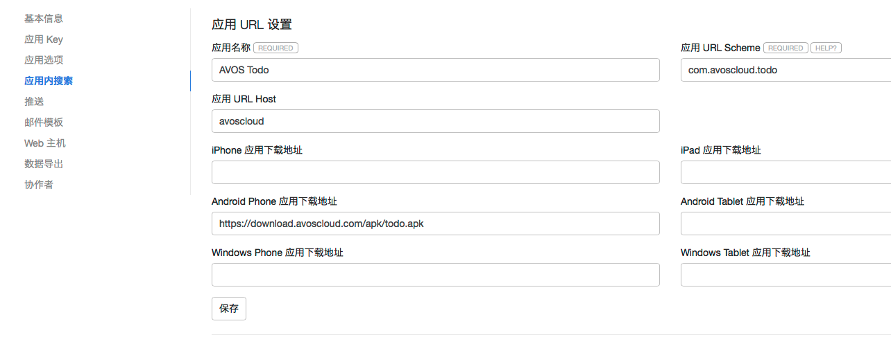
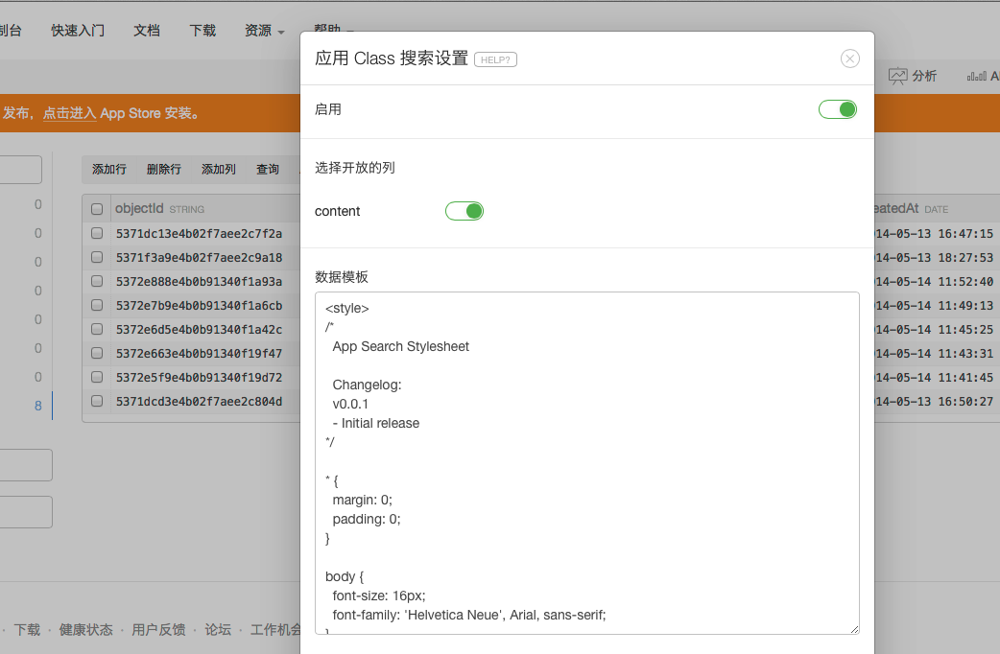

# 应用内搜索和 DeepLink 开发指南

## 简介

在应用内使用全文搜索是一个很常见的需求。例如我开发了一个阅读类的应用，里面有很多有价值的文章，我当然希望能提供一个搜索框给用户，用户键入任何关键字，都可以查找到应用内相关的文章，并按照评分排序。类似我直接在 Chrome 浏览器键入关键字打开 Google 搜索一样。

但是应用内的搜索，跟浏览器端的搜索还不大一样，应用内的搜索结果，我希望打开的不是一个 Web 页面，更希望是应用内的一个页面，比如在我的阅读 Android 应用里，我希望用`ReadActivity`来打开搜索结果的一篇文章，就跟直接打开这篇文章一样。更进一步，我希望用户可以使用移动设备在网页或者应用里搜索关键字的时候：

* 如果用户安装了应用，就直接打开应用并跳转到正确的页面
* 如果用户没有安装应用，我希望能显示一个应用的下载页面给用户，让用户来安装我的应用；
* 如果用户不愿意安装，那么用户仍然可以直接在网页查看搜索结果的内容

为了达到上述目标，并且简化开发者的开发步骤，降低开发成本，我们提供了应用内搜索组件和 App URL的 deeplink 功能（让应用响应外部调用链接）。

在你的应用内使用这个功能很简单，只要三步，请紧跟我们的脚步！ Let's do it.

**我们这里是以[TodoDemo](https://github.com/leancloud/Android-SDK-demos/tree/master/AVOSCloud-Todo)为例子。**
关于应用内搜索的部分可见[searchQuery函数](https://github.com/leancloud/Android-SDK-demos/blob/master/AVOSCloud-Todo/src/com/avos/demo/AVService.java)、[CreateTodo.java](https://github.com/leancloud/Android-SDK-demos/blob/master/AVOSCloud-Todo/src/com/avos/demo/CreateTodo.java)、[AndroidManifest.xml](https://github.com/leancloud/Android-SDK-demos/blob/master/AVOSCloud-Todo/AndroidManifest.xml)

效果图，点击`打开应用`即可跳转到具体界面


## 开发步骤

### 第一步：设置

在这一步，我们需要为设置一   些应用内搜索的选项，首先为您的应用选择一个合适的 URL Scheme，然后设置一下您的应用的下载地址等信息。

#### 设置应用内搜索选项

为了能够使用户直接从搜索结果打开您的应用，开发者需要使您的应用支持外部调用，我们使用 AppURL 来指向一个可以在应用里展现的 Class 数据，格式如下：

```
{URL Scheme}://{ URL Host}/{ Resource Path}
```

在组件菜单里，我们添加了一个新菜单——`应用内搜索`，截图如下：



其中最关键的是这几个属性：

* 应用名称 -- 您的应用名称，必须。
* 应用 URL Scheme -- 支持外部调用的 URL scheme，我们强制要求采用**域名反转**的方式，类似 Java 语言的 package 命名机制。假设您的应用的域名为`myapp.company.com`，那么我们要求的 scheme 就是形如`com.company.myapp`的字符串。例如我们的 Todo Demo 设置的scheme为`com.avoscloud.todo`。如果您没有域名，那么我们推荐您使用`com.avoscloud.{appId的前8位}`来作为 Scheme。我们会在保存的时候检测scheme是否冲突。
* 应用 URL Host -- 支持外部调用的 URL Host，可不设置，但是我们推荐默认值使用`avoscloud`，防止跟其他 AppURL 提供商冲突。


其他一些属性，都是用于设置您的应用的下载地址，例如:

* iPhone 应用下载地址 -- 您的应用的 iPhone 版本的 App Store 下载链接，或者您的网站链接。
* iPad 应用下载地址 -- 您的应用的 iPad 版本的 App Store 下载链接，或者您的网站链接。
* ……

这些链接都是可选的，当用户没有安装您的应用的时候，无法直接从搜索结果打开应用，将展示这些下载链接给用户下载您的应用。

设置保存之后，您应该可以通过下列链接访问到您的应用信息：

```
https://leancloud.cn/1.1/go/{your uri scheme}/
```

查看到您的 App URL 应用设置信息。

例如我们的todo应用就是:

```
https://leancloud.cn/1.1/go/com.avoscloud.todo
```

#### 为 Class 启用搜索

在设置了应用内搜索，选择了适当的 URL Scheme 之后，您需要选择至少一个 Class 为它开启应用内搜索。开启后，该 Class 的数据将被 LeanCloud 自动建立索引，并且可以调用我们的搜索组件或者 API 搜索到内容。

** 请注意，启用了搜索的 Class 数据，仍然只能被该应用的认证过的 API 搜索到，其次，搜索结果仍然遵循我们提供的 ACL 机制，如果您为 Class 里的Object设定了合理的ACL，那么搜搜结果也将遵循这些 ACL 值，保护您的数据安全。**

在 Class 的`其他`菜单里新增了应用内搜索菜单，打开的截图如下：



其中包括三个设定项目：

* 通过打开或者关闭`启用`，您可以启用或者关闭这个 Class 的应用内搜索功能，默认是关闭的。
* 选择开放的列 -- 您可以选择哪些字段将加入索引引擎，这些字段将可以被外部用户看到（前提是 ACL 允许）。请慎重选择开放的字段。默认情况下，`objectId,createdAt,updatedAt`三个字段将无条件加入开放字段列表。
* 数据模板 -- 设置这个 Class 的数据展现模板，当外部调用无法打开应用（通常是用户没有安装应用）的时候，将渲染这个模板并展现给用户，默认的模板的只是渲染一些下载链接，您可以自定义这个模板的样式，比如加入您的应用 Logo， 添加 CSS 等。

数据模板的语法支持[ handlebars 模板](http://handlebarsjs.com/)语法，支持的变量（使用两个大括号包起来 <code ng-non-bindable>{{{var}}}</code>）包括：

* app_uri 字符串 --  打开应用的URL，就是前面提到的`{URL Scheme} : // { URL Host} / { Resource Path}`。
* applinks 对象 -- 应用内搜索配置对象，包括这些属性：`app_name,android_phone_link,android_pad_link,iphone_link,ipad_link`等，也就是应用名称，和各种平台应用的下载链接。
* qrcode_uri 字符串 -- 本页面的二维码图片链接，用户可以用扫描器扫描打开该页面。
* object -- 查询出来的 object 对象，默认至少包括`objectId,createdAt,updatedAt`三个属性。其他是您在选择开放的列。

以我们的 Todo Demo 为例，我们启用了 Todo 的应用内搜索功能，选择了开放字段`content`，设定数据模板（消除了css）为：

<div ng-non-bindable>

```html
<div class="wrap">
  <div class="section section-open">
    <div class="section-inner">
      <p>Todo Content:  {{object.content}} </p>
    </div>
  </div>
  <div class="section section-open">
    <div class="section-inner">
      <p>已安装 {{applinks.app_name}}？您可以:</p>
      <p><a href='{{app_uri}}' class="btn">直接打开应用</a></p>
    </div>
  </div>
  <div class="section section-download">
    <div class="section-inner">
      <p>或者下载应用:</p>
      <div >
      {{#if applinks.iphone_link}}
        <p><a href='{{applinks.iphone_link}}'>iPhone 应用</a></p>
      {{/if}}

      {{#if applinks.ipad_link}}
        <p><a href='{{applinks.ipad_link}}'>iPad 应用</a></p>
      {{/if}}

      {{#if applinks.android_phone_link}}
        <p><a href='{{applinks.android_phone_link}}'>Android 手机应用</a></p>
      {{/if}}

      {{#if applinks.android_pad_link}}
        <p><a href='{{applinks.android_pad_link}}'>Android 平板应用</a></p>
      {{/if}}
    </div>
  </div>
</div>
```

</div>
在 LeanCloud 索引完成数据后，您应当可以通过下列URL访问到一条数据，如果在安装了 Todo Demo 应用的移动设备上访问下面这个URL，应该会打开应用展现这条 Todo 的内容:

```
https://leancloud.cn/1.1/go/com.avoscloud.todo/classes/Todo/5371f3a9e4b02f7aee2c9a18

```

如果直接在 PC 浏览器[打开](https://leancloud.cn/1.1/go/com.avoscloud.todo/classes/Todo/5371f3a9e4b02f7aee2c9a18?render=true)，看到的应该是数据渲染页面，如图：


### 第二步：使 App 支持外部调用

在设置了和启用了 Class 应用内搜索之后，接下来，您需要让您的应用响应搜索结果的 URL 调用。

#### Android 应用支持外部调用

在 Android 里，我们可以通过为 Activity 注册 `intent-filter` 来实现。以我们的 Todo Demo 为例，我们想在 `CreateTodo` 这个 Activity 里面展现搜索出来的某一条 Todo 内容，在`AndroidManifest.xml`注册`intent-filter`配置如下

```xml
<activity android:name="com.avos.demo.CreateTodo" >
	<intent-filter>
		<action android:name="android.intent.action.VIEW" />
		<category android:name="android.intent.category.DEFAULT" />
		<category android:name="android.intent.category.BROWSABLE" />
		<!-- 处理以"com.avoscloud.todo://avoscloud/classes/Todo/"开头的 URI -->
		<data android:scheme="com.avoscloud.todo" />
		<data android:host="avoscloud" />
		<data android:pathPrefix="/classes/Todo/" />
	</intent-filter>
</activity>
```

其中:

* android:scheme 设置为您为应用选择的 URL Scheme，这里是`com.avoscloud.todo`
* android:host 设置为您为应用选择的 URL Host，默认为`avoscloud`。
* android:pathPrefix  具体的资源路径前缀，搜索结果的URL具体路径都将展现为`/classes/{className}/{objectId}`，这里的 className 就是 `Todo`，因此路径前缀为`classes/Todo/`。
* action必须设置为`android.intent.action.VIEW`，并且加入`DEFAULT`和`BROWSABLE`的Category。

接下来在 `CreateTodo` Activity的`onCreate`方法里我们接收这个 action 并获取 URL 展现数据：


```java
   Intent intent = getIntent();
	// 通过搜索结果打开
	if (intent.getAction() == Intent.ACTION_VIEW) {
	  // 如果是VIEW action，我们通过getData获取URI
	  Uri uri = intent.getData();
	  String path = uri.getPath();
	  int index = path.lastIndexOf("/");
	  if (index > 0) {
		// 获取objectId
		objectId = path.substring(index + 1);
		Todo todo = new Todo();
		todo.setObjectId(objectId);
		// 通过Fetch获取content内容
		todo.fetchInBackground(new GetCallback<AVObject>() {
		  @Override
		  public void done(AVObject todo, AVException arg1) {
			if (todo != null) {
			  String content = todo.getString("content");
			  if (content != null) {
				contentText.setText(content);
			  }
			}
		  }
		});
	  }
	}
```


我们通过 adb 的 am 命令来测试配置是否有效，如果能够正常地调用`CreateTodo`页面，那证明配置正确：

```sh
adb shell am start -W -a "android.intent.action.VIEW" -d "yourUri" yourPackageName
```

在 Todo 例子里就是：

```sh
adb shell am start -W -a "android.intent.action.VIEW"  \
  -d "com.avoscloud.todo://avoscloud/classes/Todo/5371f3a9e4b02f7aee2c9a18" \
  com.avos.demo
```

如果一切正常的话，这将直接打开应用并在`CreateTodo`里展现 objectId 为`536cf746e4b0d914a19ec9b3`的 Todo 对象数据数据。


#### iOS 应用支持外部调用

你可以通过编辑应用 [information property list](http://developer.apple.com/library/ios/#documentation/general/Reference/InfoPlistKeyReference/Introduction/Introduction.html)，使得你的应用可以处理 URL Scheme. 下图展示了如何为你的应用注册 URL Scheme.


需要注意的是，你这里的 URL Scheme 应该和你在我们网站上面设置的 URL Scheme保持一致。

注册完了 URL Scheme，你还需要实现 [application method openURL](http://developer.apple.com/library/ios/#DOCUMENTATION/UIKit/Reference/UIApplication_Class/Reference/Reference.html#jumpTo_37) 。对于 TodoDemo，应该按照如下方法实现。

```objc
/*
 * 与 Android 类似，这里的url.path 应该是 “com.avoscloud.todo://avoscloud/classes/Todo/5371f3a9e4b02f7aee2c9a18”
 */
(BOOL)application:(UIApplication *)application openURL:(NSURL *)url sourceApplication:(NSString *)sourceApplication annotation:(id)annotation {
    NSString *objectId = [url.path lastPathComponent];

    AVObject *todo = [AVObject objectWithClassName:@"Todo"];
    todo.objectId = objectId;
    [todo fetchInBackgroundWithBlock:^(AVObject *object, NSError *error) {
        // 调用展示数据的方法
        // code is here
    }];
    return YES;
}
```


### 第三步：在应用内集成搜索组件

#### Android 集成

##### 导入SDK
您可以从 https://leancloud.cn/docs/sdk_down.html 页面下载`应用内搜索`模块,解压缩avossearch.zip压缩包，将libs下的`avossearch-v{version}.jar`包加入您的libs下面。

之后，您需要将res下的资源文件夹拷贝并且合并到您工程的res目录下，更改资源文件的内容并不影响SDK工作，但是请不要改动资源的文件名和文件内资源ID。

* 应用内搜索组件的资源文件都以avoscloud_search打头。*

##### 添加代码，实现基础功能

###### 配置 AndroidManifest.xml

打开AndroidManifest.xml文件，在里面添加需要用到的activity和需要的权限:

```xml
<uses-permission android:name="android.permission.INTERNET" />
<uses-permission android:name="android.permission.ACCESS_NETWORK_STATE" />
	<application...>
	   <activity
		  android:name="com.avos.avoscloud.search.SearchActivity">
	   </activity>
	</application>
```
*注：由于一些UI的原因，应用内搜索的最低API level要求是12，如您需要更低的版本支持，请参照文档中的高级定制部分进行开发。*

###### 添加代码实现基础的应用内搜索功能

```java
AVSearchQuery searchQuery = new AVSearchQuery("keyword");
SearchActivity.setHighLightStyle("<font color='#E68A00'>");//通过这个方法，您可以像指定html tag一样设定搜索匹配字符的高亮风格
searchQuery.search();//即可打开一个显式搜索结果的Activity
```

###### 结果排序

`AVSearchQuery`支持排序，通过`orderByAscending`和`orderByDescending`传入要排序的字段，就可以实现按照升序或者降序排序搜索结果。多字段排序，通过`addAscendingOrder`和`addDescendingOrder`来添加多个排序字段。大体上，这块 API 调用跟 `AVQuery`是类似的：

```java
AVSearchQuery searchQuery = new AVSearchQuery("keyword");
searchQuery.orderByAscending("score"); //根据score字段升序排序。
```

更复杂的排序功能，例如根据地理位置信息远近来排序，或者排序的字段是一个数组，你想使用数组内的最高值来排序等，都需要通过`AVSearchSortBuilder`来定制。

根据地理信息位置排序：

```java
AVSearchSortBuilder builder = AVSearchSortBuilder.newBuilder();
builder.whereNear("location",new AVGeoPoint(30,30));
searchQuery.setSortBuilder(builder);
```

根据数组内的最高值来排序，并且如果文档里没有这个值就放到最后：

```java
builder.orderByDescending("scores","max","last");
searchQuery.setSortBuilder(builder);
```

更多方法请参考 API doc。


#####　高级指定指南

由于每个应用的数据、UI展现要求都有很大的差别，所以单一的搜索组件界面仅仅能够满足较为简单的要求，所以我们将数据接口开放出来以便您能够方便的定制属于您自己的应用内搜索结果页面。

```java
	  AVSearchQuery search = new AVSearchQuery("test-query");
	  search.setLimit(100);
	  search.findInBackgroud(new FindCallback<AVObject>() {

		@Override
		public void done(List<AVObject> parseObjects, AVException parseException) {
		  if (parseException == null) {
			 //你可以使用parseObjects来展现自己的UI
			 for(AVObject o:parseObjects){
				//这里可以得到搜索结果和您的应用所对应的AppUrl
				String appUrl = o.getString(AVConstants.AVSEARCH_APP_URL);
				//这里可以得到搜索结果对应的语法高亮
				Map<String,List<String>> resultHighLights = ((Map<String, List<String>>)) o.get(AVConstants.AVSEARCH_HIGHTLIGHT);
			 }
			} else {
			 //Exception happened
			}
		  }
		}
	  });
```
您也可以参考我们的SearchActivity来更好的指定您自己的搜索结果页面。`https://github.com/leancloud/avoscloud-sdk/blob/master/android/avossearch/src/com/avos/avoscloud/search/SearchActivity.java`

##### 分页查询

通过`findInBackgroud`方法做定制查询的话，如果需要分页，您仅仅需要通过多次调用同一个`AVSearchQuery`的`findInBackgroud`即可实现翻页效果，它将返回下一页搜索结果，直到末尾。

搜索结果的文档总数可以通过`AVSearchQuery`的`getHits`方法得到。

##### 查询语法简介

在AVSearchQuery中间可以设置query语句来指定查询条件：`AVSearchQuery.setQuery(String query)`。

###### 基础搜索
传入最简单的字符串查询
```java
AVSearchQuery query = new AVSearchQuery("basic-query");//搜索包含basic-query的值
```
###### 字段搜索
您也可以通过指定某个特定字段的值或者值域区间
```java
query.setQuery("status:active");//搜索status字段包含active
query.setQuery("title:(quick brown)");//搜索status包含quick或者brown
query.setQuery("age:>=10");//搜索年龄大于等于10的数据
query.setQuery("age:(>=10 AND < 20)");//搜索年龄在[10,20)区间内的数据
```
###### 模糊搜索
```java
  query.setQuery("qu?c*k");//此处?代表一个字符，*代表0个或者多个字符。类似正则表达式通配符
```

更多更详细的语法资料，您可以参考Elasticsearch文档中[Query-String-Syntax](http://www.elasticsearch.org/guide/en/elasticsearch/reference/current/query-dsl-query-string-query.html#query-string-syntax)一节。

#### iOS 集成

##### 添加代码获取搜索结果
你可以参照如下代码构造 AVSearchQuery 并获取搜索结果。

```objc
AVSearchQuery *searchQuery = [AVSearchQuery searchWithQueryString:@"test-query"];
searchQuery.className = @"className";
searchQuery.highlights = @"field1,field2";
searchQuery.limit = 10;
searchQuery.cachePolicy = kAVCachePolicyCacheElseNetwork;
searchQuery.maxCacheAge = 60;
searchQuery.fields = @[@"field1", @"field2"];
[searchQuery findInBackground:^(NSArray *objects, NSError *error) {
	for (AVObject *object in objects) {
        NSString *appUrl = [object objectForKey:@"_app_url"];
        NSString *deeplink = [object objectForKey:@"_deeplink"];
        NSString *hightlight = [object objectForKey:@"_highlight"];
        // other fields
        // code is here
    }
}];
```
有关查询语法，可以参考上文 Android 部分的介绍。

对于分页，这里需要特别做出说明。因为每次请求都有 limit 限制，所以一次请求可能并不能获取到所有满足条件的记录。你可以多次调用同一个`AVSearchQuery` 的 `findObjects` 或者 `findInBackground` 获取余下的记录。另外，`hits` 属性用于标示所有满足查询条件的记录数。

```objc
/*!
 *  符合查询条件的记录条数，由 SDK 自动修改。
 */
@property (nonatomic, assign) NSInteger hits;

/*!
 *  当前页面的scroll id，用于分页，可选。
 #  @warning 如非特殊需求，请不要手动设置 sid。每次 findObjects 之后，SDK 会自动更新 sid。如果手动设置了错误的sid，将无法获取到搜索结果。
 *  有关scroll id，可以参考 http://www.elasticsearch.org/guide/en/elasticsearch/guide/current/scan-scroll.html
 */
@property (nonatomic, retain) NSString *sid;

```


## 搜索 API


我们提供一个 `/1.1/search/select` 来做应用内搜索，前提是您参考前面的文档，启用了应用内搜索。

假设你对 GameScore 类启用了应用内搜索，您就可以尝试传入关键字来搜索，比如查询关键字`dennis`，限定返回结果 200 个，并且按照`score`降序排序：

```sh
curl -X GET \
  -H "X-AVOSCloud-Application-Id: {{appid}}" \
  -H "X-AVOSCloud-Application-Key: {{appkey}}" \
  "https://leancloud.cn/1.1/search/select?q=dennis&limit=200&clazz=GameScore&order=-score"
```

返回类似：

```json
{
results: [
  {
    _app_url: "http://stg.pass.com//1/go/com.avoscloud/classes/GameScore/51e3a334e4b0b3eb44adbe1a",
    _deeplink: "com.avoscloud.appSearchTest://avoscloud/classes/GameScore/51e3a334e4b0b3eb44adbe1a"
    updatedAt: "2011-08-20T02:06:57.931Z",
    playerName: "Sean Plott",
    objectId: "51e3a334e4b0b3eb44adbe1a",
    createdAt: "2011-08-20T02:06:57.931Z",
    cheatMode: false,
    score: 1337
  },
  ……
],
sid: "cXVlcnlUaGVuRmV0Y2g7Mzs0NDpWX0NFUmFjY1JtMnpaRDFrNUlBcTNnOzQzOlZfQ0VSYWNjUm0yelpEMWs1SUFxM2c7NDU6Vl9DRVJhY2NSbTJ6WkQxazVJQXEzZzswOw=="
}
```

查询的参数支持：

* limit 返回集合大小，默认100，最大1000
* sid: 第一次查询结果中返回的 sid 值，用于分页，对应于elasticsearch中的scoll id，可选
* q: 查询文本，支持类似google的搜索语法，必须
* fields: 逗号隔开的字段列表，可选，查询的字段列表
* highlights: 高亮字段，可以是通配符 `*`，也可以是字段列表逗号隔开的字符串，可选。如果加入，返回结果会多出_highlight属性，表示高亮的搜索结果内容，关键字用`em`标签括起来。
* clazz: 类名，可选，如果没有指定，则搜索所有启用了应用内搜索的 class
* order: 排序字段，形如`-score,createdAt`逗号隔开的字段，负号表示倒序，可以多个字段组合排序，可选。
* sort: 复杂排序字段，例如地理位置信息排序，见下文描述。

返回结果属性介绍：

* results 符合查询条件的结果文档。
* hits  符合查询条件的文档总数
* sid 标记本次查询结果，下次查询继续传入这个 sid 用于查找后续的数据，用来支持翻页查询。


返回结果 results 列表里是一个一个的对象，字段是你在应用内搜索设置里启用的字段列表，并且有两个特殊字段：

* `_app_url`: 应用内搜索结果在网站上的链接。
* `_deeplink`: 应用内搜索的程序调用 URL，也就是 deeplink。


最外层的`sid`用来标记本次查询结果，下次查询继续传入这个 sid 将翻页查找后 200 条数据：

```sh
curl -X GET \
  -H "X-AVOSCloud-Application-Id: {{appid}}" \
  -H "X-AVOSCloud-Application-Key: {{appkey}}" \
  "https://leancloud.cn/1.1/search/select?q=dennis&limit=200&clazz=GameScore&order=-score&sid=cXVlcnlUaGVuRmV0Y2g7Mzs0NDpWX0NFUmFjY1JtMnpaRDFrNUlBcTNnOzQzOlZfQ0VSYWNjUm0yelpEMWs1SUFxM2c7NDU6Vl9DRVJhY2NSbTJ6WkQxazVJQXEzZzswOw"
```
直到返回结果为空。


### 复杂排序


假设你要排序的字段是一个数组，比如分数数组`scores`，你想根据平均分来倒序排序，并且没有分数的排最后，那么可以传入：

```sh
 --data-urlencode 'sort={"scores":{"order":"desc","mode":"avg","missing":"_last"}}'
```

也就是 `sort` 可以是一个 JSON 数据结构：

```json
{"scores":{"order":"desc","mode":"avg","missing":"_last"}}
```
排序的字段作为key，字段可以设定下列选项：

* order  `asc`表示升序，`desc`表示降序
* mode 如果该字段是多值属性或者数组，那么可以选择按照最小值(`min`)、最大值(`max`)、总和(`sum`)或者平均值(`sum`)来排序。
* missing 决定缺失该字段的文档排序在开始还是最后，可以选择`_last`或者`_first`，或者指定一个默认值。

多个字段排序就类似：

```json
{
 "scores":{"order":"desc","mode":"avg","missing":"_last"},
 "updatedAt": {"order":"asc"}
 }
```


### 地理位置信息查询


如果 class 里某个列是 `GeoPoint`类型，那么可以根据这个字段的地理位置远近来排序，例如假设字段 `location` 保存的是 `GeoPoint`类型，那么查询 `[-70, 40]` 附近的玩家可以通过设定 sort 为：

```json
{
  "_geo_distance" : {
                "location" : [-70, 40],
                "order" : "asc",
                "unit" : "km",
                "mode" : "min",
   }
}
```

`order` 和  `mode` 含义跟上述复杂排序里的一致，`unit`用来指定距离单位，例如`km`表示千米，`m`表示米，`cm`表示厘米等。


