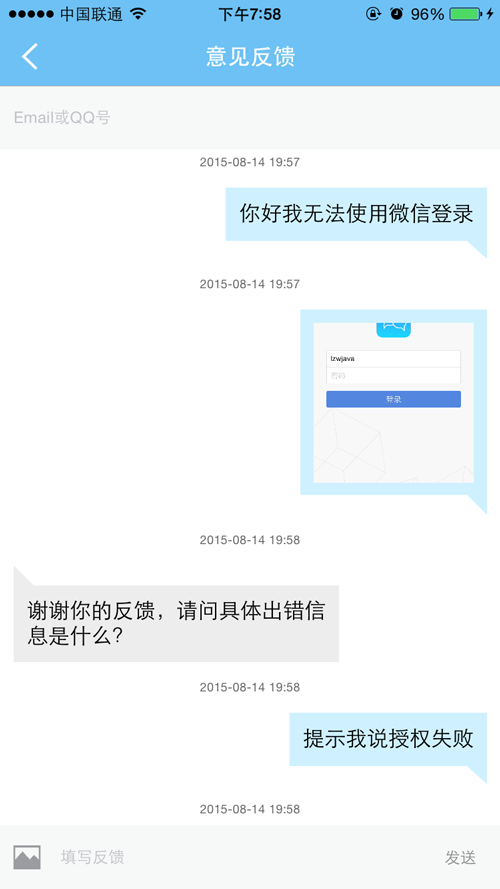

# 用户反馈组件开发指南

AVOSCloud Feedback 是一个非常轻量的模块，可以用最少两行的代码来实现一个用户反馈系统，并且能够方便的在我们的移动App中查看用户的反馈。

**您可以在应用的组件菜单里看到所有的用户反馈并回复。**

## LeanCloud移动App

用户如果有新的反馈会主动推送通知到我们提供的移动App，建议您安装，并使用LeanCloud帐户登录：

* [Android App](http://download.leancloud.cn/apk/AVOSCloudMobileApp.apk)
* [iOS App](https://itunes.apple.com/cn/app/avos-cloud-ying-yong-tong/id854896336?mt=8&uo=4)

## iOS 反馈组件

### 打开默认的用户反馈界面
开发者可以使用当前的 UIViewController 打开 AVOSCloud 提供的默认反馈界面，代码如下：

```objc
AVUserFeedbackAgent *agent = [AVUserFeedbackAgent sharedInstance];
[agent showConversations:self title:@"feedback" contact:@"test@leancloud.cn"];
```


特别指出，如果要使用默认的用户反馈界面而且手动安装了 `AVOSCloud.framework`，开发者需要将 `AVOSCloud.framwork -> Resources -> AVOSCloud.bundle` 手动拖入工程项目中。

### 自定义用户反馈界面
当然，也可以使用 `AVUserFeedbackAgent` 提供的另外两个 API 来完成用户反馈的功能。

```objc
- (void)syncFeedbackThreadsWithBlock:(NSString *)title contact:(NSString *)contact block:(AVArrayResultBlock)block;

- (void)postFeedbackThread:(NSString *)content block:(AVIdResultBlock)block;

```

上述代码中，第一个方法用于同步服务端的用户反馈数据，比如开发者对用户的反馈。你可以在回调函数中处理 AVUserFeedbackThread 数组。
第二个方法则用于发送用户反馈，只需填写反馈内容。

### AVUserFeedbackThread 数据模型
`AVUserFeedbackThread` 包含 `content` `type` `createdAt` 等属性。`content` 代表反馈内容。`type` 为反馈类型，分别为 `user` 和 `dev`。`createdAt` 为反馈内容创建时间。

## Android Feedback组件

### 导入SDK
 您可以从 https://leancloud.cn/docs/sdk_down.html 页面下载`用户反馈模块`，解压缩avoscloudfeedback.zip压缩包后，将libs下得的`avosfeedback-v{version}.jar`包（需要包括下载的其他基础jar包）加入您工程的libs下面。

之后，您需要将res下的资源文件夹拷贝并且合并到您工程的res目录下。更改资源文件的内容并不影响SDK，但是请不要改变资源的文件名和文件内资源ID。

*　注： LeanCloud Feedback Android SDK的资源文件都是以avoscloud_feedback打头。*


### 添加代码，使用基础功能

#### 配置 AndroidManifest.xml

打开AndroidManifest.xml文件，在里面添加需要用到的activity和需要的权限:

```xml
<uses-permission android:name="android.permission.INTERNET" />
<uses-permission android:name="android.permission.ACCESS_NETWORK_STATE" />
<uses-permission android:name="android.permission.WRITE_EXTERNAL_STORAGE"/>
    <application...>
       <activity
         android:name="com.avos.avoscloud.feedback.ThreadActivity" >
       </activity>
    </application>
```

*注：由于一些UI的原因，Feedback SDK的最低API level要求是12，如您需要更低的版本支持，请参照文档中的高级定制部分进行开发。

如果依然遇到Actionbar相关的NPE问题，请检查Application Theme，确保ThreadActivity中的Actionbar。*

*注：在2.5.7以后，用户反馈中添加了图片上传功能，所以在Permission中需要添加WRITE_EXTERNAL_STORAGE权限，如果您在使用过程中遇到文件类似情况，请先检查权限设置是否有相应的更新。*


#### 添加代码实现基础的反馈功能

1.在代码中启用用户反馈模块

```java
FeedbackAgent agent = new FeedbackAgent(context);
agent.startDefaultThreadActivity();
```


2.新回复通知

如果您需要在用户打开App时，通知用户新的反馈回复，只需要在您的入口Activity的OnCreate方法中添加:

```java
agent.sync();
```

*注：注意: 此功能使用了Android Support Library, 所以请添加最新版本 android-support-v4.jar 到工程的libs目录下*。

当用户收到开发者的新回复时，就会产生一个新的消息通知。如果您需要改变通知的图标，请替换res下`avoscloud_feedback_notification.png`文件即可。

如果您不需要通知栏通知，又迫切需要在用户在打开App时同步反馈信息，您可以调用

```java
agent.getDefaultThread().sync(SyncCallback);
```

这里的SyncCallback是一个异步回调，其中的方法会在同步请求成功以后被调用。


### 高级定制指南

如果我们的反馈组件UI无法满足您的需求，您可以通过Feedback SDK提供的数据模型结合自定义UI来满足您的需求。


#### Feedback数据模型

* Comment
Comment 代表了反馈系统中间，用户或者开发者的每一次回复。不同的类型可以通过CommentType属性来指定：

```java
Comment userComment = new Comment("这是一个用户反馈");//不指定CommentType类型，即为CommentType.USER
Comment anotherUserComment = new Comment("再来说一句",CommentType.USER);
Comment devComment = new Comment("开发者回复",CommentType.DEV);
```

* FeedbackThread
FeedbackThread代表了用户与开发者的整个交流过程。其中有两个个属性可供设置：
`contact`和`commentList`:

```java
FeedbackThread thread = agent.getDefaultThread();
thread.setContact("您的邮箱或者QQ账号");
thread.add(newComment);
//或者也可以使用thread.getCommentsList().add(newComment);
thread.sync(syncCallback);
```

更多的信息您可以参考我们的实现的Activity：

https://github.com/leancloud/avoscloud-sdk/blob/master/android/avoscloudfeedback/src/com/avos/avoscloud/feedback/ThreadActivity.java

*注：ThreadActivity使用了ActionBar(API 11),EditText的 textCursorDrawable属性(API 12)。*

