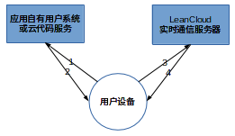

# 实时通信服务开发指南

除了实时的消息推送服务外，LeanCloud 从 2.5.9 版本开始提供实时的点对点消息服务，这意味着，你将可以通过我们的服务开发实时的用户间聊天、游戏对战等互动功能。截至目前，我们提供 Android 和 iOS 两个主要平台的客户端SDK。

我们也提供了两个平台下的 Demo， [Android Chat Demo
](https://github.com/avoscloud/Android-SDK-demos/tree/master/keepalive)
， [iOS Chat
Demo](https://github.com/avoscloud/iOS-SDK-demos/tree/master/KeepAlive)
和一个完整的社交应用
[LeanChat](https://github.com/leancloud/leanchat-android)。

## 功能和特性

为刺激你读下去的兴趣，请允许我先介绍一下实时通信服务的功能和特性，加粗
的条目是最新添加的：

* 登录，通过签名与你的用户系统集成
* 单个设备多个帐号，单个帐号多个设备，实时消息同步到所有设备
* 单聊（发给一个人），群发（发给多个人），群聊（发给一个群）
* 自定义消息解析；基于 AVFile 可以实现图片、音频和视频等丰富格式
* 通过签名控制关注权限和参与对话权限
* 上下线通知
* 群组管理，创建、加入、离开、邀请、踢出、查询、成员变动通知。
* 消息时间戳
* 离线消息
* 离线推送通知：iOS, Windows Phone
* 支持平台（排名不分先后）：
  * iOS
  * Android
  * Browser JavaScript
  * Windows Phone
  * Server-side Nodejs
* 消息记录 REST API
* 未读消息数 REST API
* 敏感词过滤
* 异常数据报警
* **消息到达回执**

## 核心概念

### Peer

实时通信服务中的每一个终端称为 Peer。Peer 拥有一个在应用内唯一标识自己
的ID。这个 ID 由应用自己定义，是不少于50个字符的字符串。系统中的每一条消息都来自于一个 Peer，发送到一个或多个 Peer。

LeanCloud 的通信服务允许一个 Peer ID 在多个不同的设备上登录，也允许一个设备上有多个 Peer ID 同时登录。开发者可以根据自己的应用场景选择ID。

为了做到细粒度的权限控制，Peer 需要先 watch 对方方可给对方发送消息，你可以在 watch 动作上增加签名认证来控制权限，防止骚扰。Super Peer（超级用户）可以在不 watch 的状态下给任意 Peer 发送消息，不过 Super Peer 的登录需要服务器端签名控制，目前仅服务器端的 NodeJS SDK 支持 Super Peer。

### Session

Peer 通过开启(open)一个 Session 加入实时通信服务，Peer 可以在 Session 中关注(watch)一组 Peer ID，当被关注者上下线时，会收到通知。Peer 在开启 Session 后会收到其他 Peer 的消息，关注(watch)其他 Peer 后也可以向其发送消息。Peer 只能向自己关注的其他 Peers 发送消息，但可以接收到其他peers的消息。

Session 的几种状态：

* **opened** Session 被打开
* **pause** 网络异常，Session 进入暂停状态，当网络恢复时 Session 会自动重开
* **closed** Session 结束，仅在显示调用 `Session.close` 方法时发生，用户注销实时通信服务，不再能够接收到消息或推送通知

Session 中的几个动词：

* **open** 以一个 Peer ID 打开 Session
* **watch** 关注一组 Peer ID，关注后可以收到这个 Peer 的上下线通知，发送消息
* **unwatch** 取消对一组 Peer ID 的关注
* **sendMessage** 给一组 Peer ID 发送消息
* **close** 注销服务，关闭 Session

在现代移动应用里，我建议仅在用户进入互动环节（打开聊天对话界面，游戏对战界面）时`watch`目标用户，这样可以有效减少对方由于网络不稳定频繁上下线发送的通知，节约流量。

### Message

实时通信服务的消息。我们的消息体允许用户一次传输不超过**5KB**的文本数据。开发者可以在文本协议基础上自定义自己的应用层协议。

消息分为暂态(transient)和持久消息。LeanCloud 为后者提供至多7天50条的离线消息。暂态消息并不保存离线，适合开发者的控制协议。

我们现在还为通信消息提供存储和获取功能，你可以通过 [REST API](rest_api.html#实时通信-api) 或 SDK（即将加入）获取整个应用或特定对话的消息记录。

### Group

聊天群组，用户加入群后向群发送的消息可以被所有群成员收到。当有群成员退出，或有新的群成员加入时，所有群成员会收到相应的通知。用户可以对群做以下几个动作：

* 创建并加入
* 加入已有群
* 离开已有群
* 将其他 peer 加入已有的群
* 将其他 peer 从已有的群踢出

如果你对实时通信服务启用签名认证（推荐），除了退出群其他操作都需要签名，签名见下文。

应用所有的群组数据存储在 `AVOSRealtimeGroups` 表中，成员数据以数组形式存储在 `m` 列，应用可以通过 API 调用获得某个群组的所有成员，和某个用户加入的所有群组。

## 权限和认证

为了满足开发者对权限和认证的需求，我们设计了签名的概念。你可以在
LeanCloud 应用控制台、设置、应用选项中强制启用签名。启用后，所有的
Session open 和 watch 行为都需要包含签名，这样你可以对用户的登录以及他
可以关注哪些用户，进而可以给哪些用户发消息进行充分的控制。



1. 客户端发起 session open 或 watch 等操作，SDK 会调用
SignatureFactory 的实现，并携带用户信息和用户行为（登录、关注或群组操
作）请求签名；
2. 应用自有的权限系统，或应用在云代码上的签名程序收到请求，进行权限验
证，如果通过则利用下文所述的签名算法生成时间戳、随机字符串和签名返回给
客户端；
3. 客户端获得签名后，编码到请求中，发给实时通信服务器；
4. 实时通信服务器通过请求的内容和签名做一遍验证，确认这个操作是经由服
务器允许的，进而执行后续的实际操作。

### 云代码签名范例

我们提供了一个运行在 LeanCloud [云代码](https://cn.avoscloud.com/docs/cloud_code_guide.html)上的
[签名范例程序](https://github.com/leancloud/realtime-messaging-signature-cloudcode)
，他提供了基于 Web Hosting 和 Cloud Function 两种方式的签名实现，你可以根据实际情况选
择自己的实现。

### 签名方法

签名采用**Hmac-sha1**算法，输出字节流的十六进制字符串(hex dump)，签名的消息格式如下

```
app_id:peer_id:watch_peer_ids:timestamp:nonce
```

其中：

* `app_id` 是你的应用 ID
* `peer_id` 是打开此 Session 的 Peer ID
* `watch_peer_ids` 是 open 或 watch 请求中关注的peer ids，**升序排序**后以`:`分隔
* `timestamp` 是当前的UTC时间距离unix epoch的**秒数**
* `nonce` 为随机字符串

签名的key是应用的 **master key**

开发者可以实现自己的SignatureFactory，调用远程的服务器的签名接口获得签名。如果你没有自己的服务器，可以直接在我们的云代码上通过 Web Hosting 动态接口实现自己的签名接口。在移动应用中直接做签名是**非常危险**的，它可能导致你的**master key**泄漏。

使用蟒蛇大法的签名范例：

```python
import hmac, hashlib

### 签名函数 hmac-sha1 hex dump
def sign(msg, k):
    return hmac.new(k, msg, hashlib.sha1).digest().encode('hex')

### 签名的消息和 key
sign("app_id:peer_id:watch_peer_ids:timestamp:nonce", "master key")
```

### 群组功能的签名

在群组功能中，我们对**加群**，**邀请**和**踢出群**这三个动作也允许加入签名，他的签名格式是：

```
app_id:peer_id:group_id:group_peer_ids:timestamp:nonce:action
```

其中：

* `app_id`, `peer_id`, `timestamp` 和 `nonce` 同上
* `group_id` 是此次行为关联的群组 ID，对于创建群尚没有id的情况，`group_id`是空字符串
* `group_peer_ids` 是`:`分隔的**升序排序**的 peer id，即邀请和踢出的 peer_id，对加入群的情况，这里是空字符串
* `action` 是此次行为的动作，三种行为分别对应常量 `join`, `invite` 和 `kick`

### Super Peer

为了方便用户的特殊场景，我们设计了超级用户（Super Peer）的概念。超级用户可以无需 watch 某一个用户就给对方发送消息。超级用户的使用需要强制签名认证。

签名格式是在普通用户的签名消息后加常量 `su`。


```
app_id:peer_id:watch_peer_ids:timestamp:nonce:su
```

## Android 实时通信服务

从一个聊天应用的开发角度，最核心的问题是消息的收发功能实现。只要能够完成一次最简单的消息收发流程，整个实时通信服务就基本上能够理解了。您可以通过下载我们的聊天Demo来了解如何使用实时通信服务来搭建一个[聊天应用](https://github.com/avoscloud/Android-SDK-demos/tree/master/keepalive)。

**注:如果您是第一次阅读LeanCloud的文档，您可能还需要知道如何去[初始化 LeanCloud SDK](https://leancloud.cn/docs/android_guide.html#应用程序) **

在Android的SDK中，你只需要运用两个类及其相关的方法，就可以轻松完成这些工作。

第一个类是`SessionManager`，这个类是你主动与服务器交流的唯一接口，从session的打开，消息的发送，到关注\取消Peer Id，都是通过这个类去调用。

第二个类是`AVMessageReceiver`，这个类是一个抽象类，通过继承这个类，并且实现他的抽象方法，它将成为你获取服务器返回的唯一接口，从别人发送给你的消息，到session的状态变化，再到Peer Id的上下线状态等都是通过它来获取的。

### 打开Session
打开Session其实非常简单，只需要通过SessionManager获取对象，调用open接口即可
```
    SessionManager session =
                SessionManager.getInstance(selfId);//获取SessionManager实例，以便于后续的操作
    session.open(watchedIds); //打开Session，同时关注一些peer Id
```

### 实现签名（可选）

如果你使用了签名认证，你需要实现`SignatureFactory`接口，并在`Session.open`前设置签名.

```java
session.setSignatureFactory(new SomeSignatureFactory(AVOSCloud.applicationId));
```

在 `SignatureFacotry#createSignature` 中，你需要从远程服务器获取签名。如果获取签名失败，比如请求被拒绝，可以抛出自定义的`RuntimeException`。

成功返回的签名对象需要包含四个字段：

* 签名
* 时间戳
* 随机字符串 nonce
* 签名通过的可关注的 signedPeerIds

### 关注、取消关注

关注和取消关注可以通过`session.watchPeers`和`session.unwatchPeers`实现。

```java
session.watchPeers(peerIds);
session.unwatchPeers(peerIds);
```

### 发送消息
调用 `session.sendMessage` 可以向其他 peers 发送消息msg，注意：必须先关注才可以给 peer 发送消息，否则消息将无法送达。

```
 session.sendMessage(new AVMessage(msg, peers, isTransient));
 //isTransient表示的是否是一个即时消息，如果是true，则表示只有当接收方为在线才能看到这个消息；如为false，则接收方可以通过推送，离线消息等方式收到这则消息
```

### 接收消息

以上关于SessionManager所有的操作几乎都是异步（除`session.setSignatureFactory`）的方法；与一般的Android异步方法调用不同，实时通信SDK的异步回调并没有通过Callback或者类似onPostExecute方法来执行。而是通过继承`AVMessageReceiver`，实现以下方法来处理来自服务器端的响应或异常：

```
  /**
   * 当服务器成功与客户端打开session时产生本次回调。在session.open调用成功以后会
   *
   * @param session
   */
  public abstract void onSessionOpen(Context context, Session session);

  /**
   * 在session 暂停时调用，一般都是由网络连接丢失导致的隐性调用
   *
   * @param session
   */
  public abstract void onSessionPaused(Context context, Session session);

  /**
   * Session 恢复时，一般都是网络连接恢复以后的
   *
   * 恢复之后可以通知UI，尝试重发失败消息等
   * @param session
   */
  public abstract void onSessionResumed(Context context, Session session);

  /**
   * 从某个Peer接收到消息时，会收到一次调用
   *
   * @param session
   * @param msg 　包含更多信息，包括来自服务器的timestamp，表示消息发送时间
   */
  public abstract void onMessage(Context context, Session session,AVMessage msg);

  /**
   * 服务器反馈消息已经成功发送时，会收到调用
   *
   * @param session
   * @param msg
   * @param receivers
   */
  public abstract void onMessageSent(Context context, Session session,AVMessage msg);

  /**
   * 在消息发送失败时，产生的调用
   *
   * @param session
   * @param msg
   * @param receivers
   */
  public abstract void onMessageFailure(Context context, Session session,AVMessage msg);

  /**
   * 当关注的一些peers上线时，产生的调用
   *
   * @param session
   * @param peerIds
   */
  public abstract void onStatusOnline(Context context, Session session, List<String> peerIds);

  /**
   * 当关注的一些peers下线时，产生的调用
   *
   * @param session
   * @param peerIds
   */
  public abstract void onStatusOffline(Context context, Session session, List<String> peerIds);

  /**
   * 当与服务器发生交互的过程中的任何错误，都在这里被返回
   *
   * @param session
   * @param e
   */
  public abstract void onError(Context context, Session session, Throwable e);
```

正如上面的代码中看到的，如果想要获得别人发送过来的消息，并不需要太多的代码，只要在`onMessage`方法中实现当别人消息发送过来以后要如何处理的业务逻辑即可，可以是发送给某个特定的UI组件，也可以是通过统一的消息中心去重新分配这些消息。

服务器时间戳，可从回调的`onMessageSent(Context context, Session session, AVMessage avMsg)`中的`avMsg.getTimestamp()`获得。

### 聊天室功能
很多用户在使用实时通信模块的时候，提及了聊天室的功能。之前的Android demo版本正是一个通过关注所有用户来实现的一个简单聊天室。
这种实现有一个明显的问题在于，客户端想要发送一条消息，保证群内的每一个人都能够收到，则需要在客户端本地维护群内的组员关系。然而从逻辑上来说，参加一个聊天室应该是，客户端对一个聊天室对象发送消息，而所以监听这个聊天室的其他客户端，都能够收到这个消息；中间有一个聊天室的抽象存在，并不是由每一个客户端去保存维护当前群内的成员状态。
鉴于这种实用的场景，我们推出了相应的功能。

#### 基本组成
与 `Session` 相类似的，聊天组的实现构成非常简单，主要涉及的类只有3个：

`Group` 来作为所有的聊天操作的接口类

`SignatureFactory`中多加入一个createGroupSignature方法来实现聊天室签名相关

`AVGroupMessageReceiver` 抽象类来接收所有的服务器反馈的聊天组消息

#### 加入一个聊天室
由于整个实时通信功能都是建立在Session的基础上，所以您要加入一个聊天室也需要建立在一个已经打开的Session上。
当您已经打开一个Session以后，可以通过一下操作来加入一个Group
```
        Group group = SessionManager.getInstance(selfId).getGroup();//新建一个聊天室
        //Group group = SessionManager.getInstance(selfId).getGroup(groupId);　加入一个已经存在的聊天室
        group.join();
```

加入成功以后您实现的`AVGroupMessageReceiver`子类中的 onJoined方法就会被调用。

#### 查询聊天室组员
在应用管理的数据中心的 `AVOSRealtimeGroups` 表中，记录所有聊天室基本信息。当你知道一个聊天室的groupId的时候，您就可以通过AVObject接口来查看这个聊天室的组员情况。
```
        AVObject groupObject = AVObject.createWithoutData("AVOSRealtimeGroups",groupId);
        groupObject.fetch();//如果您在UI进程中，请使用异步方法调用
        List groupMembers= groupObject.getList("m");

```
当然您也可以使用AVQuery来查询。

#### 管理聊天室组员
在查询到聊天室组员以后，您可以邀请一些您的朋友加入，或者踢出一些"可怕"的组员。
```
        Group group = SessionManager.getInstance(selfId).getGroup(groupId);
        List<String> toInvite = Arrays.asList("peerId1","peerId2","peerId3");
        group.inviteMember(toInvite);
        List<String> toKickOff = Arrays.asList("badBoy1","badBoy2");
        group.kickMembers(toKickOff);
```
成功以后，操作人客户端内您实现的`AVGroupMessageReceiver`子类中 `onMemberJoin`或`onMemberLeft`会被调用。

而被邀请的人或者被踢的人的客户端中，相应的`onInvited`或`onKicked`会被调用。

#### 发送消息

通过如下代码您就可以向对应的聊天室发送代码:
```
        Group group = SessionManager.getInstance(selfId).getGroup(groupId);
        group.sendMessage(new AVGroupMessage("hello world"));
```
发送成功后，操作人客户端内您实现的`AVGroupMessageReceiver`子类中 `onMessageSent`方法会被调用。
而聊天室内的其他组员的客户端，则会有 `onMessage`方法会被调用，也就是接收到来自聊天室的消息。onMessage方法中你得到的AVGroupMessage对象中会包含更多信息，包括来自服务器的消息发送时间。

#### 签名(可选)

在群组功能中，我们对**加群**，**邀请**和**踢出群**这三个动作也允许加入签名，他的签名格式是：

```
app_id:peer_id:group_id:group_peer_ids:timestamp:nonce:action
```

其中：

* `app_id`, `peer_id`, `timestamp` 和 `nonce` 同上
* `group_id` 是此次行为关联的群组 ID，对于创建群尚没有id的情况，`group_id`是空字符串
* `group_peer_ids` 是`:`分隔的 peer id，即邀请和踢出的 peer_id，对加入群的情况，这里是空字符串
* `action` 是此次行为的动作，三种行为分别对应常量 `join`, `invite` 和 `kick`

###聊天记录查询
聊天记录的查询的基本方法跟AVQuery类似但是略有不同。
针对Session的聊天记录和聊天室Group的聊天记录查询略有不同，但是基本都是一样：

```
           SessionManager sm = SessionManager.getInstance(selfId);
           AVHistroyMessageQuery sessionHistoryQuery = sm.getHistroyMessageQuery();
           sessionHistoryQuery.setLimit(1000);//设置查询结果大小
           sessionHistoryQuery.setTimestamp(1413184345686);//查询从时间片1413184345686以后开始的聊天记录
           sessionHistoryQuery.findInBackground(new HistoryMessageCallback() {

                 @Override
                 public void done(List<AVHistoryMessage> messages, AVException error) {
                      System.out.println(messages.size());
                 }
           });//查询session里的聊天记录
           Group group = sm.getGroup("140a534fd092809500e6d651e73400c7");
           AVHistroyMessageQuery groupHistoryQuery = group.getHistoryMessageQuery();//获取AVHistoryMessageQuery对象来查询聊天室的聊天记录
           groupHistoryQuery.findInBackground(new HistoryMessageCallback(){

                @Override
                public void done(List<AVHistoryMessage> messages,AVException error){
                  for(AVHistoryMessage msg:messages){
                     System.out.println(msg.getMessage());
                  }
                }
           })
```

## iOS 实时通信服务

与 Android 不同，iOS 并没有提供类似于 `service` 这样的组件。当应用进入后台，聊天组件将会关闭连接，session 进入 `paused` 状态。而当应用转入前台，聊天组件将会重新建立连接，session 进入 `resume` 状态。你可以实现 `AVSessionDelegate`相关方法，以完成实时通信应用的开发。

**注意** 请首先确保你添加了如下依赖库

* SystemConfiguration.framework
* MobileCoreServices.framework
* CoreTelephony.framework
* CoreLocation.framework
* libicucore.dylib

### 实现你的 AVSessionDelegate

同 Android 版 SDK 类似，`AVsessionDelegate` 包含了与 session 相关的各种事件。你可以实现 `AVSessionDelegate`，对这些事件做出响应。

#### sessionOpened

session 成功打开

```
- (void)sessionOpened:(AVSession *)session;
```

#### sessionPaused

已经打开的 session 由于网络原因、或者应用转入后台，因而进入暂停状态。此时无法成功地发送消息。

```
- (void)sessionPaused:(AVSession *)session;
```

#### sessionResumed

之前暂停的 session 重新恢复连接

```
- (void)sessionResumed:(AVSession *)session;
```

#### session:didReceiveMessage:

收到消息

```
- (void)session:(AVSession *)session didReceiveMessage:(AVMessage *)message;
```

#### session:messageSendFinished:

服务器确认之前发送的消息已发出

```
- (void)session:(AVSession *)session messageSendFinished:(AVMessage *)message;
```

#### session:messageSendFailed:

这些消息发出后没有及时收到服务器确认，客户端会启动重连流程，这些消息被认为发送失败。**注意**：此时连接处在已断开，不能立即重发。

```
- (void)session:(AVSession *)session messageSendFailed:(AVMessage *)message error:(NSError *)error;
```

#### session:didReceiveStatus:peerIds:

你关注的用户状态改变了

```
- (void)session:(AVSession *)session didReceiveStatus:(AVPeerStatus)status peerIds:(NSArray *)peerIds;
```

#### sessionFailed:error:

所有 `AVSession` 中操作失败会触发此回调

```
- (void)sessionFailed:(AVSession *)session error:(NSError *)error;
```

### 打开 session

```
AVSession *session = [[AVSession alloc] init];
session.sessionDelegate = self;
NSString *selfId = [self getMyUserId];

// 打开 session，并关注一些 id
[session openWithPeerId:selfId watchedPeerIds:watchedIds];
```

### 实现签名（可选）

如果使用了签名认证，你需要实现 `AVSignatureDelegate`，并在调用 `[session open]`之前为 session 设置 `signatureDelegate`：

```
session.signatureDlegate = self;
```

需要说明的是，你需要为 AVSignatureDelegate 实现的方法是：

```
- (AVSignature *)signatureForPeerWithPeerId:(NSString *)peerId watchedPeerIds:(NSArray *)watchedPeerIds action:(NSString *)action;
```

你需要做的就是按照前文所述的签名算法实现签名，其中 `AVSignature` 声明如下：

```
@interface AVSignature : NSObject

@property (nonatomic, retain) NSString *signature;
@property (nonatomic, assign) long timestamp;
@property (nonatomic, retain) NSString *nonce;
@property (nonatomic, retain) NSArray *signedPeerIds;

@end
```

其中四个属性分别是:

* 签名
* 时间戳
* 随机字符串 nonce
* 签名通过的可关注的 signedPeerIds

### 关注、取消关注

```
/*!
 *  增量关注一组 peerIds
 *  @param peerIds peer id 数组
 */
- (void)watchPeerIds:(NSArray *)peerIds;

/*!
 *  取消关注一组 peerIds
 *  @param peerIds peer id 数组
 */
- (void)unwatchPeerIds:(NSArray *)peerIds;

```

### 发送消息

使用如下方法构造一个AVMessage对象，注意：toPeerId必须是已经关注了的，否则发送消息时将无法送达。

```
/*!
 *  构造一个发送给 toPeerId 的message对象
 *  @param session 服务器会话
 *  @param toPeerId 要发往的 peerId
 *  @param payload 消息载体
 *  @return message 对象
 */
+ (AVMessage *)messageForPeerWithSession:(AVSession *)session
                                toPeerId:(NSString *)toPeerId
                                 payload:(NSString *)payload;
```

调用如下方法发送消息。

```
/*!
 *  发送消息
 *  @param message 消息对象
 */
- (void)sendMessage:(AVMessage *)message;

/*!
 *  发送消息
 *  @param message 消息对象
 *  @param transient 设置为 YES, 当且仅当某个 peer 在线才会收到该条消息，且该条消息既不会存为离线消息，也不会通过消息推送系统发出去.
 *         如果设置为 NO, 则该条消息会设法通过各种途径发到 peer 客户端，比如即时通信、推送、离线消息等。
 */
- (void)sendMessage:(AVMessage *)message transient:(BOOL)transient;
```

服务器端确认收到消息后，你会收到`session:messageSendFinished:`事件。

### 聊天室功能

iOS SDK从v2.6.1开始提供聊天室功能。客户端对一个聊天室对象发送消息，所有监听这个聊天室的其他客户端，都能够收到这个消息；聊天室成员状态发生变化，每一个客户端会收到状态变化的消息。

#### 基本组成

与 `AVSession` 相类似的，聊天组的实现构成非常简单，主要涉及的类只有3个：

`AVGroup` 来作为所有的聊天操作的接口类

`AVSignature`中多加入一个`-signatureForGroupWithPeerId:groupId:groupPeerIds:action:`方法来实现聊天室签名相关

`AVGroupDelegate` 协议用来实现接收到服务器反馈的聊天组消息后的回调处理

#### 加入一个聊天室
由于整个实时通信功能都是建立在Session的基础上，所以您要加入一个聊天室也需要建立在一个已经打开的Session上。
当您已经打开一个Session以后，可以通过一下操作来加入一个Group

```
    //新建并加入一个聊天室
    [AVGroup createGroupWithSession:session groupDelegate:self callback:^(AVGroup *group, NSError *error) {
        if (!error) {
             //聊天室创建并加入成功
        } else {
            NSLog(@"error:%@", error);
        }
    }];
    //加入一个已经存在的聊天室
    AVGroup *group = [AVGroup getGroupWithGroupId:groupId session:session];
    group.delegate = self;
    [group join];
```

加入一个已经存在的聊天室时，成功以后delegate的`-[group:didReceiveEvent:peerIds:]`方法会被调用。

#### 查询聊天室组员
在应用管理的数据中心的 `AVOSRealtimeGroups` 表中，记录所有聊天室基本信息。当你知道一个聊天室的groupId的时候，您就可以通过AVObject接口来查看这个聊天室的组员情况。

```
    AVObject *groupObject = [AVObject objectWithoutDataWithClassName:@"AVOSRealtimeGroups" objectId:groupId];
    [groupObject fetch];
    NSArray *groupMembers = [groupObject objectForKey:@"m"];
```

当然您也可以使用AVQuery来查询。

#### 管理聊天室组员
在查询到聊天室组员以后，您可以邀请一些您的朋友加入，或者踢出一些"可怕"的组员。

```
    [group invitePeerIds:@[@"peerId1",@"peerId2",@"peerId3"]];
    [group kickPeerIds:@[@"peerId1",@"peerId2",@"peerId3"]];
```

成功以后delegate的`-[group:didReceiveEvent:peerIds:]`方法会被调用。

而被邀请的人或者被踢的人的客户端中，相应的`-[group:didReceiveEvent:peerIds:]`会被调用。

#### 发送消息

通过如下代码您就可以向对应的聊天室发送代码:

```
    AVMessage *message = [AVMessage messageForGroup:group payload:@"hello world"];
    [group sendMessage:message];
```
发送成功后聊天室内的其他组员的客户端，`-[group:didReceiveMessage:]`方法会被调用，也就是接收到来自聊天室的消息。

#### 签名(可选)

在群组功能中，我们对**加群**，**邀请**和**踢出群**这三个动作也允许加入签名，他的签名格式是：

```
app_id:peer_id:group_id:group_peer_ids:timestamp:nonce:action
```

其中：

* `app_id`, `peer_id`, `timestamp` 和 `nonce` 同上
* `group_id` 是此次行为关联的群组 ID
* `group_peer_ids` 是`:`分隔的 peer id，即邀请和踢出的 peer_id，对加入群的情况，这里是空字符串
* `action` 是此次行为的动作，三种行为分别对应常量 `join`, `invite` 和 `kick`

你需要为 AVSignatureDelegate 实现的方法是：

```
- (AVSignature *)signatureForGroupWithPeerId:(NSString *)peerId groupId:(NSString *)groupId groupPeerIds:(NSArray *)groupPeerIds action:(NSString *)action
```

###聊天记录查询
聊天记录的查询使用AVHistoryMessageQuery实现。可以通过不同参数构造不同类型的查询：
#### 通用查询

```
+ (instancetype)query;
+ (instancetype)queryWithTimestamp:(int64_t)timestamp limit:(int)limit;
```

#### 查询指定ConversationId的记录

```
+ (instancetype)queryWithConversationId:(NSString *)conversationId;
+ (instancetype)queryWithConversationId:(NSString *)conversationId timestamp:(int64_t)timestamp limit:(int)limit;
```

#### 查询来自指定peerId的记录

```
+ (instancetype)queryWithFromPeerId:(NSString *)fromPeerId;
+ (instancetype)queryWithFromPeerId:(NSString *)fromPeerId timestamp:(int64_t)timestamp limit:(int)limit;
```

#### 查询两个peerId之间的记录

```
+ (instancetype)queryWithFirstPeerId:(NSString *)firstPeerId secondPeerId:(NSString *)secondPeerId;
+ (instancetype)queryWithFirstPeerId:(NSString *)firstPeerId secondPeerId:(NSString *)secondPeerId timestamp:(int64_t)timestamp limit:(int)limit;
```

#### 查询指定群组的记录

```
+ (instancetype)queryWithGroupId:(NSString *)groupId;
+ (instancetype)queryWithGroupId:(NSString *)groupId timestamp:(int64_t)timestamp limit:(int)limit;
```

#### 实例
查询早于timestamp的 MyPeerId 和 TheOtherPeerId 之间的10条聊天记录

```
    AVHistoryMessageQuery *query = [AVHistoryMessageQuery queryWithFirstPeerId:@"MyPeerId" secondPeerId:@"TheOtherPeerId" timestamp:timestamp limit:10];
    [query findInBackgroundWithCallback:^(NSArray *objects, NSError *error) {
        if(!error) {
            //do something
        } else {
            NSLog(@"%@", error);
        }
    }];
```

查询群组 MyGroupId 的所有聊天记录

```
    AVHistoryMessageQuery *query = [AVHistoryMessageQuery queryWithGroupId:@"MyGroupId"];;
    [query findInBackgroundWithCallback:^(NSArray *objects, NSError *error) {
        if(!error) {
            //do something
        } else {
            NSLog(@"%@", error);
        }
    }];
```

## Windows Phone 8.0 SDK
### 安装
为了支持实时聊天，我们依赖了一个开源的第三方的 WebSocket 的库，所以推荐开发者从[Nuget](https://www.nuget.org/packages/AVOSCloud.Phone/1.2.3.1-beta)上下载我们的 SDK。

为了更方便开发者阅读和理解 SDK 里面的各种抽象概念，我们先从一个应用场景来简单地剖析实时聊天组件在 Windows Phone 8.0 SDK 中如何使用。

### 场景设定
* 应用场景：参考微信单聊，微博私信
* 实现需求：用户A（UserA）想与用户B（UserB）进行单独聊天
* 实现步骤：

```
  Step1.UserA 创建 AVSession 与 LeanCloud 服务端建立长连接
  Step2.UserA 告诉 LeanCloud 服务端我要关注（Watch）UserB
  Step3.UserA 发送消息给 LeanCloud 服务端，因为在第二步的时候，已经关注了 UserB，LeanCloud 服务端就会把这条信息发送给 UserB
  Step4.UserB 想接受到别人发的消息，也需要创建 AVSession 与 LeanCloud 服务端建立长连接
  Step5.UserB 告诉 LeanCloud 服务端我也要关注（Watch）UserA
  Step6.UserB 就能收到第3步，由 UserA 发来的消息了。
```

以上逻辑是一个最基本的聊天系统应该有的逻辑交互，在 LeanCloud 中，实现以上步骤需要如下代码：

```
  AVSession session = new AVSession("UserA");//Step1
  session.WatchPeer("UserB");//Step1
  session.SendMessage("Hello,B!", "UserB", true);//Step3
```
这是UserA需要做的事情，UserB 想要实现接受的话需要如下几步：

```
  AVSession session = new AVSession("UserB");Step4
  session.WatchPeer("UserA");//Step5
  session.SetListener(new SampleAVSessionListener()
            {
                OnMessage = (s, msg) =>
                {
                    var content = msg.Message;
                    MessageBox.Show(content);
                }
            });
  ///最后这一步要做详细的解释。
  ///SampleAVSessionListener 是一个实现了接口 IAVSessionListener 简单的类，它实现了 IAVSessionListener 代理，
  ///这些代理的主要作用就是用来监听 SDK 所发出的具体的事件的响应。
```
附上`SampleAVSessionListener`的代码，开发者可以讲如下代码拷贝到 Visual Studio 中：

```
 public class SampleAVSessionListener : IAVSessionListener
 {
        public SessionOpen OnSessionOpen { get; set; }//AVSession打开时执行的代理。

        public SessionPaused OnSessionPaused { get; set; }//AVSession 与服务端断开连接时执行的代理，一般都是因为 WP 手机锁屏或者应用被切换至后台了，所执行的代理。

        public SessionResumed OnSessionResumed { get; set; }//AVSession 重连成功之后执行的代理。

        public SessionClosed OnSessionClosed { get; set; }//关闭 AVSession 之后执行的代理。

        public Message OnMessage { get; set; }//接受到消息时执行的代理。

        public MessageSent OnMessageSent { get; set; }//消息发送成功之后执行的代理。

        public MessageFailure OnMessageFailure { get; set; }//消息发送失败执行的代理。

        public StatusOnline OnStatusOnline { get; set; }//当前用户的关注的人上线了所执行的代理（类似QQ好友上线了的敲门的声音）

        public StatusOffline OnStatusOffline { get; set; }//关注的人下线了。

        public PeersWatched OnPeersWatched { get; set; }//关注成功了所执行的代理（类似QQ好友通过验证之后，加为好友）

        public PeersUnwatched OnPeersUnwatched { get; set; }//取消关注之后所执行的代理。

        public Error OnError { get; set; }//发生错误时所执行的代理，例如抛出一些异常。

  }
```
这样只要2边同时运行，就可以 UserB 就可以收到来自 UserA 发来的信息。

以上代码和逻辑顺序能够很好的理解的话，关于 `IAVSessionListener` 这个接口的作用也一目了然，它所承担的职责就是帮助开发者用自己的代码与 SDK 进行交互，比如 `OnSessionOpen`：

```
每一次创建了一个 AVSession，只要连接创建成功，都会激发 OnSessionOpen 代理。
```
以此类推，根据开发者不同的需求需要对不同的代理做出相应的处理。也正因为如此，SDK 中只定义了接口，并没有定义一个强类型的类去给开发者使用，接口很方便于开发者将现有的一些功能类集成一下 `IAVSessionListener`。

**注意：在任何时候创建了 `AVSession` 之后一定要主动并且显式的调用一下 `AVSession.SetListener` 方法，讲代理设置成开发者自己定义的代理类，这一点是**必须做的**。

### 目前 Windows Phone 8 SDK 所支持的
目前尚在公测版，仅支持单聊的操作，群组聊天以及聊天记录，签名授权等都会尽快推出，欢迎开发者一起参与。


##  JS SDK

我们已经开源 JS Messaging SDK 了， 见 [Git Repo](https://github.com/leancloud/realtime-messaging-jssdk) 。


## FAQ

### 我有自己的用户系统

我们并不强制接入实时消息服务的应用使用 LeanCloud 的用户系统。实时消息服务中的 PeerId 可以由用户任意指定，只要在用户系统中保证一致即可（在匿名聊天 Demo KeepAlive 里我们用的是 installationId）。对已有用户系统的应用来说，你可以使用自己的用户 ID 作为 PeerId，并通过[签名](realtime.html#权限和认证)做权限认证。

### 聊天支持图片、语音吗？

当然支持。你可以把图片、语言等 blob 上传到我们的文件存储服务，再传输 URL，并在 UI 上进行适当地展示。这么做的好处：

* 可以传输大文件，避免超过 5K 的消息大小限制
* 节省流量：聊天的对方只要接收一个 URL 文本即可，图片和语音是可选下载
* 加速：我们的 CDN 提供更快的下载速度，对图片还支持自动缩略图

### 聊天离线时可以推送吗？

当然可以。我们的Android聊天服务是和后台的推送服务共享连接的，所以只要有网络就永远在线，不需要专门做推送。消息达到后，你可以根据用户的设置来 判断是否需要弹出通知。网络断开时，我们为用户保存50条的离线消息。

iOS在应用退出前台后即离线，这时收到消息会触发一个APNS的推送。因为APNS有消息长度限制，且你们的消息正文可能还包含上层协议，所以 我们现在APNS的推送内容是让应用在控制台设置一个静态的APNS json，如“你有新的未读消息” 。

### 聊天记录

聊天记录的查询我们支持 4 种方式：

* 按对话查询，对话 id 即所有对话参与者的 peerId 排序后以`:`分隔`md5`所得的字符串；
* 按群组查询，对话 id 即群组 id；
* 按用户查询，你可以查到某一个用户的所有消息，以时间排序；
* 按应用查询，你可以查到自己应用中所有的消息，以时间排序。

参考消息记录的 [REST API](rest_api.html#实时通信-api)。

### 未读消息数

你可以调用 [REST API](rest_api.html#实时通信-api) 获得某个用户的未读消息数。

### 黑名单

我们目前的设计里，黑名单等权限控制是通过签名来实现的。如果你是自己比较成熟的应用，你可能已经有了一定的用户关系、屏蔽关系，我们把这个步骤通过签名来实现，避免你把所有的关系数据都同步到我们的服务器。

如果你启用了签名，用户间发起对话、用户进入聊天群组，都需要通过服务器签名认证，在这一步应用可以实施自己的黑名单功能。

### 自动回复的客服

我们的 nodejs 客户端正在开发中，届时你可以利用 nodejs 客户端编写一些机器人，或是和自有的系统集成。


### 我希望给群组增加一些自定义数据，如名字

我们的群组信息实际上是 LeanCloud 的一个标准的数据表 `AVOSRealtimeGroups`。对于群组的元信息，你可以在关联的表里设置，也可以在这个表里添加新的列。请对这个表设置合理的 ACL 来保证内容不会被恶意篡改。

**注意请不要通过修改 `m` 列来改变群组成员**，这样目标用户无法收到通知，会造成数据不一致的情况。
