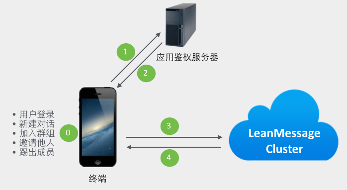
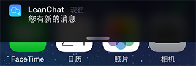
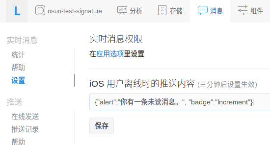
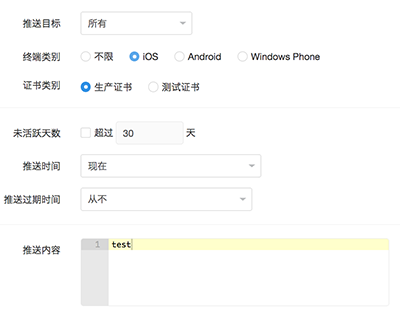
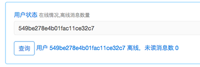
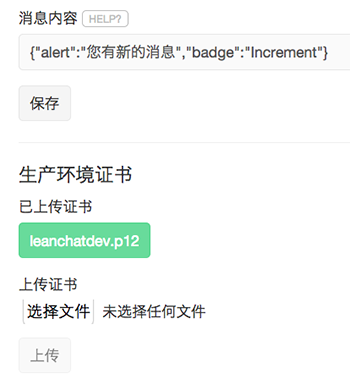

# 实时通信服务开发指南（v2）

实时通信服务是 LeanCloud 消息服务中重要的一环。使用这一服务，您不但可以在应用中轻松加入实时聊天、私信等功能，更可以用来实现游戏对战等实时互动功能。

目前，我们提供 Android、iOS、JavaScript、Windows Phone 四个主要平台的客户端 SDK，也提供了一些 Demo 帮助您快速入门：

* iOS 和 Android 的聊天 Demo 应用：[KeepAlive Android 版](https://github.com/leancloud/android-keepalive) 以及 [KeepAlive iOS 版](https://github.com/leancloud/ios-keepalive)
* [JavaScript Demo](https://github.com/leancloud/leanmessage-javascript-sdk/tree/master/demo)
* 便于调试的 [在线测试工具](http://chat.avosapps.com/)。


## 功能和特性

我们的实时消息服务定位于完美实现网络层的通讯能力，所以设计目标聚焦在：

* 快捷 —— LeanCloud 云端要能支持上亿终端的同时在线，并且消息传递延时需要严格控制在 100 ms以内。
* 灵活 —— 我们要为完全依托 LeanCloud 平台的用户考虑，也要为自有账户系统的用户设计：如果用户自己有完备的后台和账户系统，应该完全不用暴露内部数据就能使用我们的服务。而且，消息通知的手段要多样化，要让开发者有更多定制的能力：譬如聊天时对方不在线，应该能走 push notification 的通道来及时提醒对方，push 消息的具体内容应该能让开发者进行私人定制，等等。
* 安全 —— 我们的聊天服务，也应该赋予开发者更多的安全控制能力，来保证聊天通道的私密性。

LeanCloud 实时通信服务的特性主要有：

* 与账户系统解耦合。任何终端用户要加入聊天，只需要提供一个唯一标识自己的 userId 即可，无需其他额外信息，这样可以尽量避免自有账户系统的应用数据暴露，也可以让通信服务专注做好底层的「信使」服务；
* 支持单个设备多个帐号、单个帐号多个设备同时登录，实时消息同步到所有设备；
* 支持单聊、群聊、聊天室等聊天形式，并且具备完善的群组管理功能；
* 支持文本、图片、音频、视频和地理位置等多种格式的富媒体消息，并且开发者还可方便地自定义扩展；
* 消息在对方离线时，会自动通过消息推送来及时送达对方，并且推送的消息文本可以由开发者自己控制；
* 敏感词过滤。实时消息中出现的敏感词，会自动被过滤掉；对于部分 VIP 客户，我们还允许自定义仅属于自己应用的敏感词列表。
* 聊天记录自动保存在云端，允许开发者自由获取；
* 第三方操作鉴权机制。为了保证通信通道的安全，也给开发者最大的控制自由，我们提供了操作鉴权的机制：允许开发者使用自己的服务器来对消息流向进行控制。对于聊天过程中的重要操作（譬如登录、邀请加入群组、从群组踢出某人，等），LeanMessage SDK 在发送请求之前，会先到开发者自己的鉴权服务器获得操作许可，LeanMessage 云端会完全按照开发者鉴权服务器的结果来对操作予以放行或者拒绝。

## 核心概念

### userId

实时通信服务中的每一个终端称为 user。user 拥有一个在应用内唯一标识自己的 id。这个 id 由应用自己定义，只要求是少于 50 个字符长度的字符串。

在大部分场合，这里的一个 user 都可以对应到你应用上的某个「用户」，但是并不是只有真的用户才能当成这里的 user，你完全可以把一个探测器当成一个 user，把它收集到的数据通过实时通信服务广播给更多「人」。

LeanCloud 的通信服务允许一个 user id 在多个不同的设备上登录，也允许一个设备上有多个 user id 同时登录。开发者可以根据自己的应用场景选择 id。

### Conversation

用户登录之后，与其他人进行沟通，即为开启了一个对话（Conversation），不管是单聊还是群聊，都属于对话，只是参与人数有差异。

所有的消息都属于一个对话（Conversation），都是由一个 user 发出，到达某一个目标对话，然后 LeanCloud 云端会把该消息推送到本对话中的其他参与者。

对于群组对话，用户加入群后向群发送的消息可以被所有群成员收到。当有群成员退出，或有新的群成员加入时，所有群成员会收到相应的通知。用户可以对群做以下几个动作：

* 创建并加入
* 加入已有群
* 离开已有群
* 邀请其他 user 加入已有的群
* 将其他 user 从已有的群踢出

### Message

实时通信服务的消息。我们的消息体允许用户一次传输不超过 **5 KB**的文本数据。开发者可以在文本协议基础上自定义自己的应用层协议。

消息分为普通消息和暂态(transient)消息。LeanCloud 云端对于普通消息会提供接收回执、自动存储到历史消息、离线推送等功能；但是对于暂态消息，则只保证做到「尽可能送达」，并不执行前述 3 种操作，所以适合开发者的控制协议。譬如聊天过程中「某某正在输入中...」这样的状态信息，就适合通过暂态消息来发送，而用户输入的正式消息，则应该用普通消息来发送。

为了方便开发者使用，我们也提供了几种封装好的富媒体消息类型，譬如文本（TextMessage）、图片（ImageMessage）、音频（AudioMessage）、视频（VideoMessage）、位置（LocationMessage）消息，方便大家快速实现出类似于微信一样的聊天功能。开发者也可以基于我们的框架，方便地扩展出自己的消息类型。


## 权限和认证

为了满足开发者对权限和认证的需求，我们设计了签名的概念。你可以在 LeanCloud 应用控制台 -> 设置 -> 应用选项中强制启用签名。启用后，所有的用户登录、新建/加入对话、邀请/踢出对话成员等操作都需要包含签名，这样你可以对用户登录以及聊天室管理进行充分的控制。



1. 客户端进行登录或新建对话等操作，SDK 会调用 SignatureFactory 的实现，并携带用户信息和用户行为（登录、新建对话或群组操作）请求签名；
2. 应用自有的权限系统，或应用在云代码上的签名程序收到请求，进行权限验证，如果通过则利用**下文所述的签名算法**生成时间戳、随机字符串和签名返回给客户端；
3. 客户端获得签名后，编码到请求中，发给 LeanCloud 实时通信服务器；
4. 实时通信服务器通过请求的内容和签名做一遍验证，确认这个操作是经由服务器允许的，进而执行后续的实际操作。

### 云代码签名范例

我们提供了一个运行在 LeanCloud [云代码](https://cn.avoscloud.com/docs/cloud_code_guide.html)上的
[签名范例程序](https://github.com/leancloud/realtime-messaging-signature-cloudcode)
，他提供了基于 Web Hosting 和 Cloud Function 两种方式的签名实现，你可以根据实际情况选
择自己的实现。

### 用户登录的签名

签名采用**Hmac-sha1**算法，输出字节流的十六进制字符串(hex dump)，签名的消息格式如下

```
appid:clientid::timestamp:nonce
```

其中：

* `appid` 是你的应用 ID
* `clientid` 是登录时使用的 user id
* `timestamp` 是当前的UTC时间距离unix epoch的**秒数**
* `nonce` 为随机字符串

签名的 key 必须是应用的 **master key**，您可以在应用设置的应用 Key 里找到，请保护好 Master Key ，不要泄露给任何无关人员。

开发者可以实现自己的 SignatureFactory，调用远程的服务器的签名接口获得签名。如果你没有自己的服务器，可以直接在我们的云代码上通过 Web Hosting 动态接口实现自己的签名接口。在移动应用中直接做签名是**非常危险**的，它可能导致你的**master key**泄漏。

### 开启对话的签名

新建一个对话的时候，签名的消息格式为：
```
appid:clientid:sorted_conversation_member_ids:timestamp:nonce
```

其中：
* `appid`, `clientid`, `timestamp` 和 `nonce` 的含义同上
* `sorted_member_ids` 是`:`分隔的**升序排序**的 user id，即邀请参与该对话的成员列表


### 群组功能的签名

在群组功能中，我们对**加群**，**邀请**和**踢出群**这三个动作也允许加入签名，他的签名格式是：

```
appid:clientid:convid:sorted_member_ids:timestamp:nonce:action
```

其中：

* `appid`, `clientid`, `sorted_member_ids`, `timestamp` 和 `nonce` 的含义同上。对加入群的情况，这里`sorted_member_ids`是空字符串。
* `convid` 是此次行为关联的对话 id
* `action` 是此次行为的动作，三种行为分别对应常量 `join`, `invite` 和 `kick`

### Super User

为了方便用户的特殊场景，我们设计了超级用户（Super User）的概念。超级用户可以往任何一个对话(conversation)发送消息。超级用户的使用需要强制签名认证。

签名格式是在普通用户的签名消息后加常量 `su`。


```
appid:clientid:convid:sorted_conversation_member_ids:timestamp:nonce:su
```

## Android 开发指南（v2）

参考 [Android 实时通信开发指南](./android_realtime_v2.html)

## iOS 开发指南（v2）

参考 [iOS 实时通信开发指南](./ios_realtime_v2.html)

## Windows Phone 8.0 开发指南（v2）

参考 [Windows Phone 8.0 开发指南](dotnet_realtime_v2.html)

##  JavaScript 开发指南（v2）

我们已经开源 JS Messaging SDK 了， 见 [leancloud/realtime-messaging-jssdk](https://github.com/leancloud/realtime-messaging-jssdk) 。


## 云代码 Hook

云代码 hook 允许你通过自定义的云代码函数处理实时通信中的某些事件，修改
默认的流程等等。目前我们开放了两个需求比较强烈的 hook 云函数：

* _messageReceived 消息达到服务器，群组成员已解析完成之后
* _receiversOffline 消息发送完成，存在离线的收件人

关于如何定义云函数，你可以参考[云代码部分的说明](https://cn.avoscloud.com/docs/cloud_code_guide.html#cloud-函数)。所有云代码调用都有默认超时时间和容错机制，在出错的情况下将按照默认的流程执行后续的操作。

### _messageReceived

这个 hook 发生在消息到达实时通信服务，如果是群组消息，我们会解析出所有消息收件人。

你可以通过返回参数控制消息是否需要被丢弃，删除个别收件人，还可以修改消
息内容。返回空对象则会执行系统默认的流程。

#### 参数

参数 | 说明
--- | ---
fromPeer | 消息发送者的 ID
convId   | 消息所属对话的 ID
transient | 是否是 transient 消息
content | 消息体字符串
receipt | 是否要求回执
timestamp | 服务器收到消息的时间戳，毫秒
sourceIP | 消息发送者的 IP

#### 返回

参数 | 说明
--- | ---
drop | 可选，如果返回 truthy 值消息将被丢弃
content | 可选，修改后的 content，如果不提供则保留原消息

### _receiversOffline

这个 hook 发生在有收件人离线的情况下，你可以通过这个 hook 自定义离线推
送行为，包括推送内容、被推送用户或略过推送。你也可以直接在 hook 中触发
自定义的推送。

#### 参数

参数 | 说明
--- | ---
fromPeer | 消息发送者 ID
convId   | 消息所属对话的 ID
offlinePeers | 数组，离线的收件人列表
content | 消息内容
timestamp | 服务器收到消息的时间戳，毫秒

#### 返回

参数 | 说明
--- | ---
skip | 可选，如果是 truthy 值将跳过推送（比如已经在云代码里触发了推送或者其他通知）
offlinePeers | 可选，数组，筛选过的推送收件人
pushMessage | 可选，推送内容，支持自定义 JSON 结构

示例应用 [LeanChat](https://github.com/leancloud/leanchat-android) 也用了云代码 Hook 功能来自定义消息推送，通过解析上层消息协议获取消息类型和内容，通过`fromPeer`得到发送者的名称，组装成 `pushMessage`。这样，能使推送通知的用户体验更好。可参考[相应的代码](https://github.com/leancloud/leanchat-cloudcode/blob/master/cloud/mchat.js)。

## FAQ

### 我有自己的用户系统，怎么接入？

我们并不强制接入实时消息服务的应用使用 LeanCloud 的用户系统。实时消息服务中的 userId 可以由用户任意指定，只要在用户系统中保证一致即可（在匿名聊天 Demo KeepAlive 里我们用的是 installationId）。对已有用户系统的应用来说，你可以使用自己的用户 ID 作为 userId，并通过[签名](realtime.html#权限和认证)做权限认证。

### 聊天离线时如何推送？

当然可以。我们的 Android 聊天服务是和后台的推送服务共享连接的，所以只要有网络就永远在线，不需要专门做推送。消息达到后，你可以根据用户的设置来 判断是否需要弹出通知。网络断开时，我们为用户保存 50 条的离线消息。

iOS 在应用退出前台后即离线，这时收到消息会触发一个APNS的推送。因为 APNS 有消息长度限制，且你们的消息正文可能还包含上层协议，所以 我们现在 APNS 的推送内容是让应用在控制台设置一个静态的APNS json，如“您有新的消息” 。





桌面图标也会有相应的红点`badge`，清除 `badge` 的操作请参考 [iOS推送指南](push_guide.html#清除-badge)。

云代码 Hook 已支持自定义消息推送，可推送具体的消息内容，可参考[云代码-Hook](realtime.html#云代码-hook) 章节。


### 为什么我的 iPhone 收不到离线消息推送？

请先看上一个 FAQ。在控制台的设置页面，填写“您有新的未读消息”后，当对方不在线的时候，便会触发一个 APNS 的推送。首先，请确保控制台能向 iOS 推送消息，也即如下图所示的推送能顺利到达 iOS 系统，请参考[消息推送指南](push_guide.html#ios消息推送)。



之后，还要确保对方确实是离线，如果对方程序在前台并且网络良好，则不会触发推送。如果对方网络未连接，则下次联网的时候收到回调，也不触发推送。也可以利用控制台实时消息页的用户状态查询来确保对方是在离线状态，如下图。



离线消息推送用的是生产环境编辑框里上传的证书，即无论下图中上传的是您应用的开发证书还是生产证书，都将用来作为 iOS 离线消息推送使用的证书。所以，调试时可能要上传开发证书，如果应用已发布不方便更改这里的证书，您可以创建另外一个应用来调试。 [LeanChat](https://github.com/leancloud/leanchat-ios) 应用在调试期间所用的证书，如下图。



检查方法总结如下：

* 检查普通的 iOS 推送是否到达
* 在控制台检查接收方是否在离线状态

### 聊天记录

聊天记录的查询我们支持 4 种方式：

* 按对话查询，对话 id 即所有对话参与者的 peerId 排序后以`:`分隔`md5`所得的字符串；
* 按群组查询，对话 id 即群组 id；
* 按用户查询，你可以查到某一个用户的所有消息，以时间排序；
* 按应用查询，你可以查到自己应用中所有的消息，以时间排序。

参考消息记录的 [REST API](rest_api.html#实时通信-api)。

### 未读消息数

你可以调用 [REST API](rest_api.html#实时通信-api) 获得某个用户的未读消息数。

### 敏感词过滤怎么做

我们在服务器端已经通过一份敏感词的列表对目前消息进行过滤，这部分功能无需用户参与，是内置默认支持的。

### 能否通过 API 给用户发消息

对于不方便使用 Node.js 客户端的用户，我们最近提供了一个 [REST API](https://leancloud.cn/docs/rest_api.html#%E9%80%9A%E8%BF%87-rest-api-%E5%90%91%E7%94%A8%E6%88%B7%E5%8F%91%E6%B6%88%E6%81%AF) 用于给特定用户发消息。
